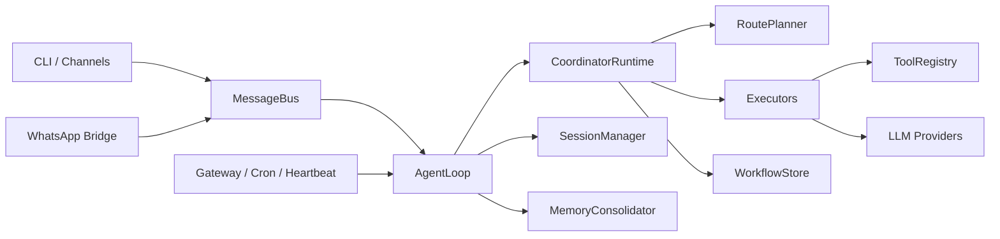

# fubot

<div align="center">

本地优先的多通道、多智能体助手框架

[](./pyproject.toml)
[](./bridge/package.json)
[](./LICENSE)

</div>

`fubot` 面向希望在本地或私有环境中构建 AI 助手系统的开发者与团队。项目以 Python 为主运行时，提供 CLI、网关服务、多聊天通道接入、工具调用、会话与记忆持久化、多智能体任务编排，以及基于 Provider 健康状态的模型路由与回退能力。

`fubot` 关注的是一套可以持续运行、可恢复、可审计、可扩展的代理执行底座。

## 项目状态

- 当前版本：`0.2.0`
- 开发状态：Alpha
- 主要运行时：Python 3.11+
- 可选桥接层：Node.js 20+（用于 WhatsApp Bridge）
- 默认本地数据目录：`~/.fubot`
- 仓库内提供了一份可直接参考的运行时配置：[`runtime/config.json`](./runtime/config.json)

## 为什么选择 fubot

- 本地优先。配置、工作区、会话、工作流和长期记忆都保存在本地文件系统中，适合私有化部署和离线运维场景。
- 入口统一。CLI、定时任务、Heartbeat 和多聊天通道共享同一条消息总线与代理执行链路。
- 架构清晰。项目将消息接入、任务编排、模型路由、工具执行、状态持久化拆分为明确模块，便于二次开发。
- 工具可控。文件、Shell、Web、消息、定时任务、后台子代理和 MCP 工具都经过统一注册、校验和权限约束。
- 路由可审计。每个任务的执行器、模型、Provider、回退链路和执行日志都会写入工作区，便于问题追踪。
- 适合长期运行。内置会话管理、记忆整理、定时任务、心跳唤醒和任务取消/重启机制，适合常驻型智能体服务。

## 核心能力

### 1. 多智能体运行时

项目默认启用 `Coordinator + Executors` 架构。协调器会先对用户输入做任务分类，再为任务挑选执行器与模型路由策略。

当前内置的执行角色包括：

- `generalist`：通用问答、写作、沟通类任务
- `builder`：编码、修改、重构类任务
- `researcher`：检索、调研、信息收集类任务
- `verifier`：测试、校验、审查类任务
- `operator`：定时、运维、执行型任务

在编码、调研、审查、测试等任务上，运行时支持按配置并行分派多个执行器，并在最后合成统一结果。

### 2. 多通道消息接入

仓库当前已经实现的通道模块包括：

- Telegram
- Discord
- Slack
- WhatsApp
- 飞书
- 钉钉
- QQ
- 企业微信
- Matrix
- Mochat
- Email

所有通道都通过统一的 `MessageBus` 与代理核心解耦。通道的接入、发送、权限校验和消息转发都通过同一套抽象完成；不同通道只需要实现自己的 `BaseChannel` 子类即可。

说明：部分通道需要额外依赖、平台凭据或外部桥接服务后才能启用。

### 3. 工具系统

当前内置工具覆盖：

- 文件系统：`read_file`、`write_file`、`edit_file`、`list_dir`
- Shell：`exec`
- Web：`web_search`、`web_fetch`
- 主动消息：`message`
- 后台子代理：`spawn`
- 定时任务：`cron`
- MCP：按配置动态挂载为 `mcp_<server>_<tool>`

工具在运行时按执行角色注入，支持参数校验、只读/副作用执行模式区分，以及副作用工具的回放保护。
MCP 连接方式同时支持 `stdio`、`SSE` 和 `streamable HTTP`。

### 4. Provider 与模型路由

项目支持三类模型接入方式：

- 直接连接 OpenAI 兼容接口：`custom`
- 通过 LiteLLM 接入多家 Provider
- OAuth Provider：如 `openai_codex`、`github_copilot`

当前配置层已内置 `anthropic`、`openai`、`openrouter`、`deepseek`、`groq`、`dashscope`、`gemini`、`moonshot`、`ollama`、`vllm`、`azure_openai`、`aihubmix`、`siliconflow`、`volcengine`、`byteplus` 等 Provider 元数据。运行时会结合模型名、显式 Provider 指定、健康缓存和冷却窗口决定最终路由，并在必要时触发回退。

### 5. 会话、记忆与工作流持久化

项目使用多层持久化方案：

- 会话历史：按 `JSONL` 追加写入，保存在工作区 `sessions/`
- 长期记忆：保存在 `memory/MEMORY.md`
- 历史摘要：保存在 `memory/HISTORY.md`
- 工作流状态：按工作流写入 `workflows/*.json`
- Provider 健康缓存：写入 `workflows/provider-health.json`
- 定时任务：写入运行时 `cron/jobs.json`

这种设计保证了系统在重启后仍可恢复关键上下文，同时保留完整的执行审计信息。

### 6. 自动化能力

- `CronService` 支持一次性、固定间隔和标准 Cron 表达式三类调度方式
- `HeartbeatService` 周期读取 `HEARTBEAT.md`，决定是否唤醒代理执行任务
- 代理支持 `/stop` 取消当前任务、`/restart` 原地重启进程
- `spawn` 工具可以启动后台子代理，并继承父级路由信息

## 快速开始

### 环境要求

- Python 3.11 或更高版本
- `pip`
- 可选：Node.js 20 或更高版本（仅在使用 WhatsApp Bridge 时需要）

### 安装

安装基础运行时：

```bash
python -m pip install -e .
```

安装开发依赖：

```bash
python -m pip install -e .[dev]
```

如果需要对应通道的额外依赖，也可以按需安装：

```bash
python -m pip install -e .[matrix]
python -m pip install -e .[wecom]
```

### 初始化

执行首次初始化：

```bash
fubot onboard
```

该命令会完成以下工作：

1. 在 `~/.fubot/config.json` 创建或刷新配置文件
2. 在 `~/.fubot/workspace` 创建默认工作区
3. 同步工作区模板文件，例如 `AGENTS.md`、`SOUL.md`、`USER.md`、`TOOLS.md`、`HEARTBEAT.md`
4. 在交互式环境下引导配置 LLM 与常见聊天通道

### 第一次运行

单次执行：

```bash
fubot agent -m "请总结当前项目的结构"
```

交互模式：

```bash
fubot agent
```

指定仓库内配置运行：

```bash
fubot agent -c runtime/config.json -m "你好"
```

启动网关：

```bash
fubot gateway -c runtime/config.json
```

查看状态：

```bash
fubot status
fubot channels status
```

### Docker

构建镜像：

```bash
docker build -t fubot .
```

使用 Compose 启动网关：

```bash
docker compose up fubot-gateway
```

## 常用命令

| 命令 | 说明 |
| --- | --- |
| `fubot onboard` | 初始化配置和工作区 |
| `fubot agent` | 启动交互式 CLI |
| `fubot agent -m "..."` | 单次执行消息 |
| `fubot gateway` | 启动常驻网关，接管通道、定时任务和 Heartbeat |
| `fubot status` | 查看配置、工作区与 Provider 状态 |
| `fubot channels status` | 查看通道启用情况 |
| `fubot channels login` | 启动 WhatsApp Bridge 并扫描二维码登录 |
| `fubot provider login openai-codex` | 启动 OpenAI Codex OAuth 登录 |
| `fubot provider login github-copilot` | 启动 GitHub Copilot 登录 |

会话内可用的斜杠命令包括：

- `/new`：归档当前会话并开始新会话
- `/help`：查看可用命令
- `/stop`：停止当前会话中的活跃任务
- `/restart`：重启当前 `fubot` 进程

## 配置说明

### 最小 LLM 配置

如果使用 OpenAI 兼容接口，最小配置可以写成：

```json
{
  "llm": {
    "provider": "custom",
    "baseUrl": "https://your-openai-compatible-endpoint/v1",
    "apiKey": "YOUR_API_KEY",
    "modelId": "YOUR_MODEL_ID"
  },
  "agents": {
    "defaults": {
      "workspace": "~/.fubot/workspace",
      "contextWindowTokens": 65536,
      "maxToolIterations": 40
    }
  },
  "tools": {
    "restrictToWorkspace": true
  }
}
```

### 配置约定

- 配置模型基于 `Pydantic`，兼容 `camelCase` 和 `snake_case`
- 环境变量覆盖前缀为 `FUBOT_`
- 工作区默认路径为 `~/.fubot/workspace`
- 当 `tools.restrictToWorkspace=true` 时，文件与 Shell 工具会收紧到工作区范围
- 生产环境中，所有聊天通道都应显式设置 `allowFrom`

### 仓库内示例配置

[`runtime/config.json`](./runtime/config.json) 提供了一个适合本仓库直接运行的示例：

- LLM 入口为 OpenAI 兼容接口
- 工作区指向 `runtime/workspace`
- 默认启用 `restrictToWorkspace`

这份配置适合作为本地调试起点，不建议直接带着默认密钥占位投入生产。

## 工作方式

`fubot` 的一次完整执行大致分为以下几个阶段：

1. 通道或 CLI 将消息写入 `MessageBus`
2. `AgentLoop` 读取消息，加载会话历史、长期记忆、模板上下文和技能摘要
3. `CoordinatorRuntime` 对任务做分类，并挑选适合的执行器
4. `RoutePlanner` 选择模型与 Provider，并生成可审计的路由决策
5. 执行器使用隔离的 `ToolRegistry` 调用工具、访问模型、产出结果
6. 结果与执行日志写入 `WorkflowStore`
7. `SessionManager` 持久化对话历史，`MemoryConsolidator` 按 token 压力整理记忆
8. 网关将最终结果回送到 CLI 或聊天通道

下面的示意图概括了主链路：



## 实现方案

### 整体架构

| 模块 | 作用 | 关键实现 |
| --- | --- | --- |
| `fubot/cli` | 命令行入口与交互式会话 | `Typer`、`prompt_toolkit`、`rich` |
| `fubot/channels` | 聊天通道抽象与平台适配 | `BaseChannel`、`ChannelManager` |
| `fubot/bus` | 消息总线 | 基于 `asyncio.Queue` 的入站/出站队列 |
| `fubot/agent` | 上下文构建、主循环、子代理、工具装配 | `AgentLoop`、`ContextBuilder`、`SubagentManager` |
| `fubot/orchestrator` | 多智能体编排与模型路由 | `CoordinatorRuntime`、`RoutePlanner`、`WorkflowStore` |
| `fubot/providers` | 模型 Provider 抽象与适配 | `CustomProvider`、`LiteLLMProvider`、`AzureOpenAIProvider` |
| `fubot/session` | 会话持久化 | 追加式 `JSONL` |
| `fubot/cron` | 定时任务服务 | `CronService` |
| `fubot/heartbeat` | 心跳唤醒执行 | `HeartbeatService` |
| `bridge/` | WhatsApp Node.js Bridge | `ws` + `Baileys` |

### 多智能体编排

编排层不是简单地把一次用户输入直接送给单个模型，而是先做任务分类，再基于配置决定：

- 是否启用多执行器
- 哪些角色有资格参与当前任务
- 每个角色可用哪些工具
- 模型与 Provider 应如何选择
- Provider 失败后是否允许降级或切换

路由决策会保留 `trace_id`、父子路由关系、回退链、尝试次数和健康分数，便于问题审计。

### 工具执行与安全边界

工具系统围绕统一的 `Tool` 抽象展开，主要安全策略包括：

- 文件工具阻止路径穿越，并可限制在工作区内
- Shell 工具内置危险命令模式拦截
- Web 抓取会阻止访问私有地址、回环地址和本地域名，避免 SSRF
- 副作用工具支持基于幂等键的回放保护
- MCP 工具要求显式注册，并设置超时

这意味着 `fubot` 既能执行复杂任务，也保留了相对可控的运行边界。

### 上下文与记忆

上下文构建由以下几个部分组成：

- 运行时身份信息
- 工作区模板文件：`AGENTS.md`、`SOUL.md`、`USER.md`、`TOOLS.md`
- 长期记忆：`memory/MEMORY.md`
- 技能摘要与按需加载的 `SKILL.md`
- 会话中的追加式消息历史

当上下文长度逼近上限时，系统会触发记忆整理逻辑，将旧消息归档到 `MEMORY.md` 和 `HISTORY.md`，而不是直接篡改会话原始记录。

### 多通道与 Bridge 方案

多通道能力采用“统一消息总线 + 平台适配器”模式：

- 各通道负责平台协议、登录态和格式转换
- 通道层统一把入站消息转成 `InboundMessage`
- 代理层统一把结果转成 `OutboundMessage`
- WhatsApp 通过独立的 Node.js Bridge 对接，Bridge 默认仅绑定 `127.0.0.1`

这使得 Python 核心运行时与第三方聊天协议实现保持解耦。

## 项目结构

```text
.
├── bridge/                 # WhatsApp Node.js bridge
├── fubot/
│   ├── agent/              # 主循环、上下文、子代理、工具集成
│   ├── bus/                # 消息总线
│   ├── channels/           # 各聊天通道实现
│   ├── cli/                # Typer CLI
│   ├── config/             # 配置模型、加载与路径解析
│   ├── cron/               # 定时任务
│   ├── heartbeat/          # 心跳服务
│   ├── orchestrator/       # 多智能体编排与路由
│   ├── providers/          # 模型 Provider 抽象与实现
│   ├── session/            # 会话管理
│   ├── skills/             # 内置技能
│   └── templates/          # 工作区模板
├── runtime/                # 仓库内示例运行配置
├── tests/                  # 测试
├── COMMUNICATION.md        # 协作与评审约定
├── SECURITY.md             # 安全建议
└── pyproject.toml          # Python 项目配置
```

## 开发与测试

安装开发依赖后，可直接运行测试：

```bash
pytest
```

建议至少覆盖以下回归面：

- 编排与模型路由
- 通道接入与权限语义
- 工具调用与副作用回放保护
- Cron、Heartbeat 与重启/停止命令
- Provider 重试与回退逻辑

仓库还提供了一个 Docker 自检脚本：

```bash
bash tests/test_docker.sh
```

## 安全建议

在生产环境部署前，建议至少确认以下几点：

- 不要把密钥写入源码；优先放在配置文件或环境变量中
- 为所有通道配置 `allowFrom`
- 尽量启用 `restrictToWorkspace=true`
- 不要将 Bridge 暴露到公网
- Email 通道必须在明确授权前提下使用

更详细的安全说明见 [`SECURITY.md`](./SECURITY.md)。

## 相关文档

- [`SECURITY.md`](./SECURITY.md)：运行安全策略与事件处置建议
- [`COMMUNICATION.md`](./COMMUNICATION.md)：代码协作与评审约定
- [`fubot/skills/README.md`](./fubot/skills/README.md)：内置技能说明

## License

本项目基于 [MIT License](./LICENSE) 开源。
